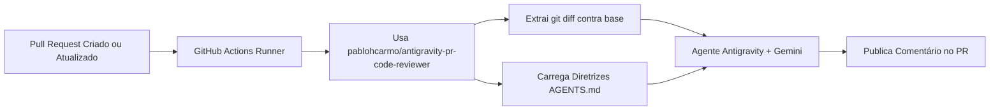
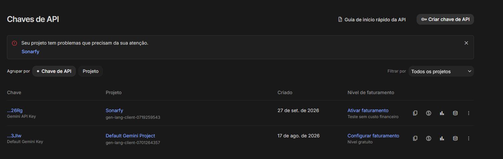
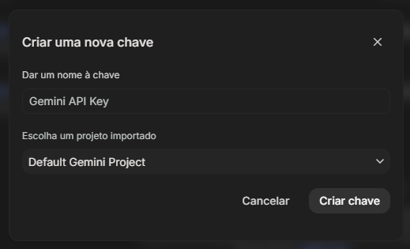
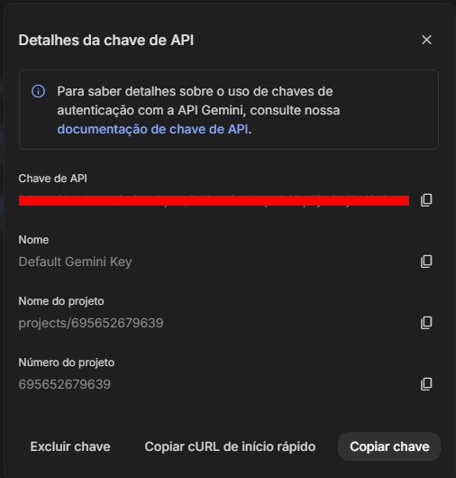
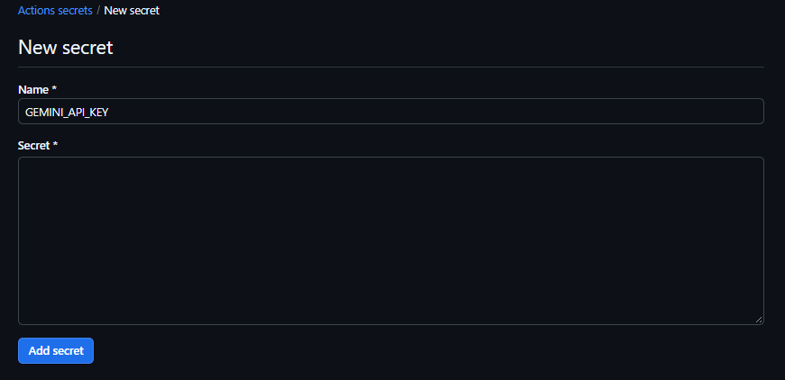
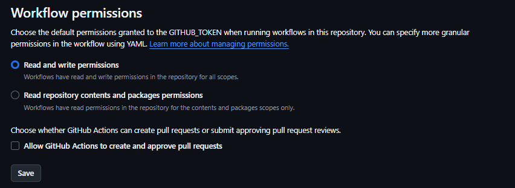

# 🤖 Antigravity PR Code Reviewer (GitHub Action)

> Agente autônomo de Code Review para Pull Requests potencializado por **Google Antigravity** e **Gemini**, empacotado como uma **GitHub Action reutilizável**.

Com esta Action, você **não precisa copiar scripts, instalar pacotes ou recriar o agente** em cada um dos seus repositórios. Basta adicionar um workflow mínimo de poucas linhas e qualquer Pull Request passará a ser revisado automaticamente por um agente com postura sênior, analisando segurança, performance, arquitetura e manutenibilidade.

---

## 📑 Sumário

- [Por que usar como GitHub Action?](#-por-que-usar-como-github-action)
- [Como Funciona](#-como-funciona)
- [Passo a Passo de Configuração](#-passo-a-passo-de-configuração)
  - [1. Obter a Chave de API no Google AI Studio](#1-obter-a-chave-de-api-no-google-ai-studio)
  - [2. Configurar a Chave no GitHub (Repositório ou Organização)](#2-configurar-a-chave-no-github-repositório-ou-organização)
  - [3. Adicionar o Workflow no Repositório de Destino](#3-adicionar-o-workflow-no-repositório-de-destino)
- [Personalizando as Regras (Opcional)](#-personalizando-as-regras-opcional)
- [Parâmetros da Action (Inputs)](#-parâmetros-da-action-inputs)
- [Estrutura do Projeto](#-estrutura-do-projeto)
- [Resolução de Problemas (Troubleshooting)](#-resolução-de-problemas-troubleshooting)
- [Licença](#-licença)

---

## ✨ Por que usar como GitHub Action?

| Abordagem Tradicional (Scripts no Repo) | Com esta GitHub Action |
| :--- | :--- |
| ❌ Copiar scripts Python e requirements para todo projeto. | ✅ **Zero arquivos de script** no projeto de destino. |
| ❌ Atualizar manualmente scripts em cada repositório. | ✅ Atualizações centralizadas diretamente na Action. |
| ❌ Duplicação de código e manutenção custosa. | ✅ Apenas **1 arquivo de workflow `.yml`** no repo. |
| ❌ Configurar secrets individualmente. | ✅ Pode usar **Organization Secrets** (uma única vez para todos os repos). |

---

## 🏛 Como Funciona



1. Quando um Pull Request é aberto ou atualizado em qualquer repositório, o GitHub Actions dispara.
2. A Action invoca o agente **Antigravity** com as diretrizes de engenharia.
3. Se o seu repositório possuir um arquivo `AGENTS.md`, a Action usará as suas regras personalizadas. Caso contrário, utilizará as diretrizes de alto padrão de segurança e arquitetura pré-configuradas na própria Action.
4. O comentário formatado em Markdown com análise crítica e sugestões de código é publicado diretamente no PR via GitHub CLI (`gh`).

---

## 🚀 Passo a Passo de Configuração

### 1. Obter a Chave de API no Google AI Studio

O agente utiliza os modelos do Google Gemini. Para gerar a chave gratuita:

1. Acesse o **[Google AI Studio](https://aistudio.google.com/)** e autentique-se com sua conta Google.
2. No menu lateral ou superior, acesse a seção de **Chaves de API** (*Get API key*).
3. Clique em **Criar chave de API** (*Create API key*).



*Figura 1: Acessando a tela de Chaves de API no Google AI Studio.*

4. Na janela **Criar uma nova chave**, informe um nome de identificação (ex: `Gemini API Key`), selecione o projeto do Google Cloud e clique em **Criar chave**.



*Figura 2: Definindo o nome da chave e o projeto associado.*

5. Na tela seguinte de **Detalhes da chave de API**, clique em **Copiar chave** e salve-a.



*Figura 3: Janela com a chave de API pronta para ser copiada.*

---

### 2. Configurar a Chave no GitHub (Repositório ou Organização)

Você tem duas formas de disponibilizar a chave para os workflows:

#### Opção A: Em uma Organização (Recomendado para múltiplos repositórios)
Se os seus repositórios pertencem a uma Organização no GitHub, você só precisa cadastrar a chave **uma única vez**:
1. Vá na sua **Organização** > **Settings** > **Secrets and variables** > **Actions**.
2. Clique em **New organization secret**.
3. Nome: `GEMINI_API_KEY`.
4. Valor: cole a chave do AI Studio.
5. Em **Repository access**, selecione **All repositories**.
> Pronto! Todos os repositórios da organização terão acesso automático sem precisar cadastrar secret por repositório.

#### Opção B: Em um Repositório Específico
1. No repositório desejado, vá em **Settings** > **Secrets and variables** > **Actions**.
2. Clique em **New repository secret**.
3. Nome: `GEMINI_API_KEY`.
4. Valor: cole a chave da API.
5. Clique em **Add secret**.


*Figura 4: Adicionando o secret GEMINI_API_KEY nas configurações do GitHub.*

---

### 3. Adicionar o Workflow no Repositório de Destino

No repositório onde você deseja que os reviews automáticos aconteçam, crie apenas o arquivo:

📁 `.github/workflows/code-review.yml`

```yaml
name: Antigravity Code Review

on:
  pull_request:
    types: [opened, synchronize, reopened]

permissions:
  contents: read
  pull-requests: write

concurrency:
  group: ${{ github.workflow }}-${{ github.event.pull_request.number || github.ref }}
  cancel-in-progress: true

jobs:
  review:
    runs-on: ubuntu-latest
    if: github.actor != 'dependabot[bot]'

    steps:
      - name: Checkout do repositório
        uses: actions/checkout@v4
        with:
          fetch-depth: 0

      - name: Executar Code Review com Antigravity
        uses: pablohcarmo/antigravity-pr-code-reviewer@v1
        with:
          gemini_api_key: ${{ secrets.GEMINI_API_KEY }}
```

> [!IMPORTANT]
> Certifique-se de que o repositório permite permissões de escrita para o workflow em **Settings > Actions > General > Workflow permissions** (**Read and write permissions**).


*Figura 5: Configurando permissões de leitura e escrita para workflows no repositório.*

---

## 🎨 Personalizando as Regras (Opcional)

A Action já vem com diretrizes completas de segurança (OWASP), performance e Clean Code baseadas no arquivo [AGENTS.md](file:///AGENTS.md).

Se o seu repositório de destino precisar de regras específicas (ex: exigir convenções de pastas, stack tecnológica particular ou proibir certas libs), basta criar um arquivo `AGENTS.md` na raiz do seu projeto. A Action detectará e aplicará suas regras customizadas automaticamente!

Caso queira usar um arquivo com outro nome ou caminho, use o input `agents_file`:

```yaml
      - name: Executar Code Review com Antigravity
        uses: pablohcarmo/antigravity-pr-code-reviewer@v1
        with:
          gemini_api_key: ${{ secrets.GEMINI_API_KEY }}
          agents_file: 'docs/CODE_REVIEW_RULES.md'
```

---

## ⚙️ Parâmetros da Action (Inputs)

| Input | Obrigatório | Padrão | Descrição |
| :--- | :---: | :---: | :--- |
| `gemini_api_key` | **Sim** | — | Chave de API do Google Gemini gerada no Google AI Studio. |
| `github_token` | Não | `${{ github.token }}` | Token do GitHub com permissão de escrita em PRs. |
| `agents_file` | Não | `AGENTS.md` | Caminho do arquivo de regras customizado no repositório cliente. |

---

## 📂 Estrutura do Projeto

```text
├── .github/
│   └── workflows/
│       └── code-review.yml       # Teste local / CI da própria Action
├── scripts/
│   └── ai_code_review.py         # Script Python do Agente Antigravity
├── images/                       # Capturas de tela e documentação
├── action.yml                    # Definição oficial da GitHub Action Composta
├── AGENTS.md                     # Diretrizes padrão de revisão sênior
├── requirements.txt              # Dependências (google-antigravity)
├── LICENSE                       # Licença MIT
└── README.md                     # Documentação de uso
```

---

## 🧪 Exemplo de Review no PR

Quando qualquer Pull Request for aberto, o agente analisa as alterações e responde diretamente:

<!-- ADICIONE SUA CAPTURA DE TELA ABAIXO -->

*Figura 6: Comentário detalhado gerado pela Action no Pull Request.*

---

## 🛠 Resolução de Problemas (Troubleshooting)

| Sintoma | Causa Mais Provável | Solução |
| :--- | :--- | :--- |
| `GEMINI_API_KEY não configurada. Review ignorado.` | Secret não cadastrado no repositório ou na organização. | Cadastre o secret `GEMINI_API_KEY` nas configurações de Actions. |
| `gh: Resource not accessible by integration` | O workflow não tem permissão para comentar no PR. | Marque **Read and write permissions** em **Settings > Actions > General > Workflow permissions** e inclua `pull-requests: write` no workflow. |
| `Nenhuma alteração de código encontrada para revisar.` | O checkout não possui histórico dos branches. | Garanta que o passo de checkout contenha `fetch-depth: 0`. |

---

## 📄 Licença

Distribuído sob a licença open-source [MIT](file:///LICENSE).